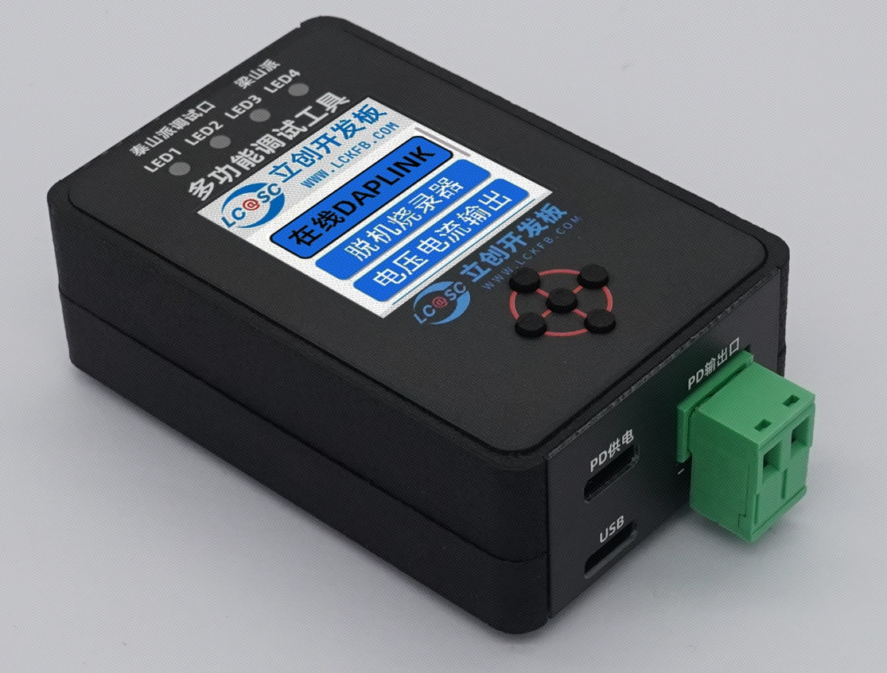
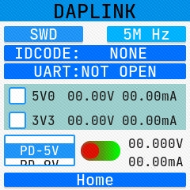
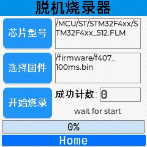
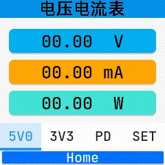
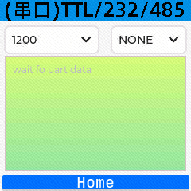
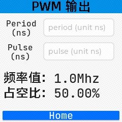
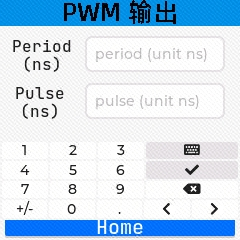
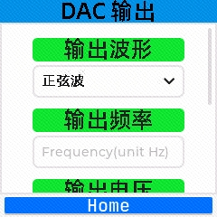

# 项目介绍

本多功能调试器是基于[天空星（GD32F407VET6青春版）](https://lckfb.com/project/detail/lckfb-lspi-skystar-gd32f407vet6-lite?param=baseInfo)开发板制作，扩展板与开发板通过双路40P排针连接，支持在线DAPLINK；离线脱机烧录；可实时检测三路（5V0，3V3，PD）的电压电流输出；自带串口监视器（支持TTL，RS232，RS485）；PWM输出；DAC波形输出等功能。

支持梁山派，天空星系列开发板以及其他原版DAPLINK支持芯片的调试与下载，支持泰山派开发板的调试。

该项目使用`RT-Thread5.1.0`，`LVGL8.3`，`DAPLINK`，`CherryUSB-0.10.2`，`CherryRB`，`uMCN`等开源项目实现，是学习天空星极佳的综合项目，其中涉及USB，UI，文件系统，ADC+DMA+TIMER高速定时采样，SWD协议实现脱机下载，串口+DMA+ringbuffer实现高速串口收发，PWM输出，DAC波形输出等内容。

# 功能介绍

## 在线DAPLINK

将本调试器通过数据线和电脑连接，打开KEIL(MDK)选择调试器为`CMSIS-DAP Debugger`后就当成普通DAPLINK使用就可以了，在KEIL中设置调试协议（Port）(SWD/JTAG)，设置最大调试时钟在DAPLINK界面也会同步刷新信息。为了保证调试速度，只实现了winusb版本的DAPLINK，同时也支持了CDC模拟的串口，最高支持2M的波特率，当然，就把他当做普通的串口工具用就可以，不需要专门的上位机，在串口软件中选择正确的端口号，打开后界面也会同步刷新，显示当前的波特率，数据位数，校验位和停止位信息。

同时，为了方便大家在实际使用中对电源的需求，这里也提供了5V，3V3，PD诱骗档位及使能的控制和这三路的电压电流信息，可以通过这5向导航按键来控制对应的输出状态。

## 离线脱机烧录

本功能主要是在脱离电脑的情况下对目标芯片执行下载功能，适合在批量生产电路板时给工厂使用。当前初版支持STM32F4系列，GD32F4系列和CH32F4A系列，也就是天空星当前有的三个版本的离线脱机烧录，后面会逐步适配更多可供下载的芯片类型。

通过5向导航按键分别选择对应的芯片型号（FLM下载算法文件），选择要下载的固件文件（当前只支持bin文件），然后选中开始烧录按键，单击中间就会开始下载了，下方的进度条如果能正常走完就说明下载成功。进度条右上方的文本是提示信息，对进一个芯片进行下载会经过以下几个步骤：

1. 检查所选的固件文件路径是否过长。
2. 判断所选的固件文件是不是以.bin后缀结尾，然后以只读模式打开。
3. 将FLM文件加载到目标单片机的RAM里面，其实FLM文件就是普通的单片机程序（就是.axf文件改了个后缀），这个程序里面包含了对目标单片机内部FLASH的操作（初始化，擦除扇区，擦除整个FLASH，编程扇区，校验，查空等），我们只需要把这个文件写入到目标单片机的RAM，然后解析各个函数的偏移地址最后按需调用就可以了。
4. 计算读取固件的大小，擦除对应目标单片机的内部FLASH。
5. 通过解析FLM文件得到操作目标芯片FLASH的函数偏移地址，通过这个地址去调用已经加载到目标单片机RAM里面的函数实现对目标单片机FLASH的编程。
6. 进行读回校验，重新打开所选中的固件，按照对应偏移去读取已经写入目标芯片内部FLASH的内容。
7. 执行复位，让目标单片机从FLASH开始运行。

## 电压电流输出

本功能实现了三路电压电流及功率的显示，总共有四个页面，前三个页面每个页面有三个显示栏，从上往下依次是各对应通道的电压，电流及功率。最后一个页面是对前面三路电源的使能控制，以及对PD诱骗档位的调节控制。

## 串口监视器

本功能实现了简单的串口查看功能，受限于芯片性能，数据多了后会比较卡，如果串口数据很多还是建议大家使用电脑上的串口助手软件。这个页面的左上角是对串口波特率的配置，右上角是对串口校验位的配置，默认情况下是8位数据位，1位停止位，这两个参数是不支持在该界面下配置的。当前的每个界面功能都是独立运行的，即使在其他界面也可以在电脑上使用CDC串口的功能，这个界面只适合简单查看调试数据，如果真的需要接收大量数据，还是乖乖连接电脑使用吧，不要为难自己。

## PWM输出

本功能实现了PWM的输出，可以通过虚拟小键盘设置PWM的周期长度和脉宽长度，虚拟小键盘隐藏后在下方会自动计算出频率和占空比

## DAC输出

本功能实现了正弦波，方波，三角波，梯形波，上升斜坡锯齿波，下降斜坡锯齿波及自定义任意波形的输出，可以设置输出频率，最高200KHz。通过虚拟小键盘可以设置频率，输出电压，设置自定义任意波形数据，这些值改变后就会实时更新并通过DAC引脚输出。

## 文件浏览器

该功能支持单纯的浏览，不支持图片或文本查看功能，仅用于供用户临时查看TF卡目录和文件是否装填正常，主要用于在脱机下载界面进行下载算法和固件文件的选择。