# 硬件开源地址

# 硬件框图

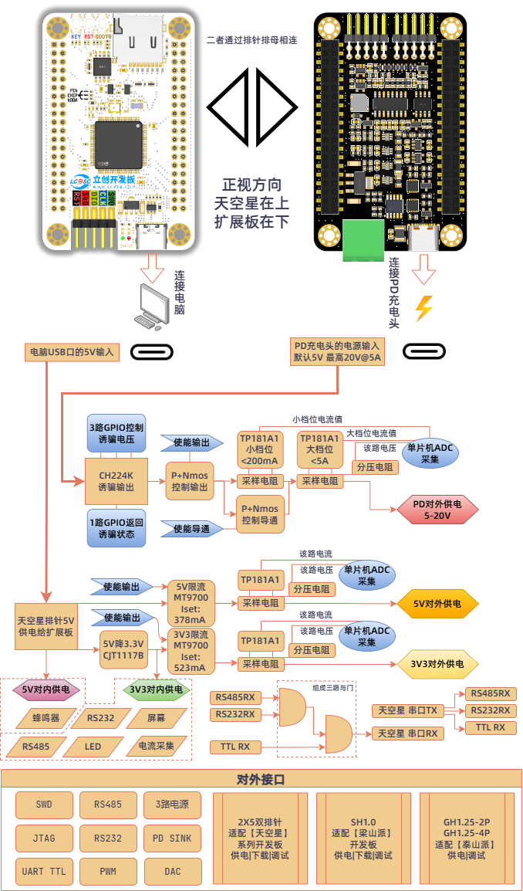

# 扩展板原理图分析

## 引脚分配

此多功能功能调试器扩展板以[GD32F407VET6版天空星开发板](https://item.szlcsc.com/21952830.html)为控制主体，所以第一张原理图就是对天空星开发板的引脚分配。

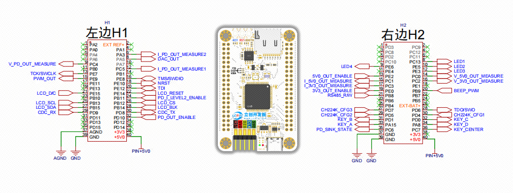

可以看到中间是天空星开发板的正视图，左右两边是他的两个40P排针，具体的引脚分配功能还需要配合下面几页原理图来理解。可以看到这两个排针的37-40号引脚是供电部分，我这里用到了从USB过来的5V，GND和AGND，没有用从板子上的LDO过来的3V3,主要是因为扩展板上就有一个5V转3.3V的LDO，这样可以让ADC采集更加稳定，并且模拟地AGND也供给扩展板上的TP181和电阻分压使用了。

排针引脚标注大部分是黑色的，部分引脚是灰色的，灰色的这部分引脚就是被天空星板载的SPI-FLASH和TF卡使用的，比如H1的PA4，PA5，PA6，PA7就是通过0欧姆电阻和SPI-FLASH使用的，当前天空星青春版是没有贴这个器件的，所以这里的PA5作为DAC输出是没问题的。H2的PD2，PD3，PC8，PC9，PC10，PC11，PC12也是通过0欧姆电阻和TF卡座相连的，在使用这些引脚前，先要确保你不需要使用TF卡这个功能。在这个项目中，我们需要用TF卡座来装载TF卡，用来存放脱机下载部分的下载算法和待下载固件，所以引脚分配时就不能使用这些灰色的引脚。

大家在进行引脚分配时需要结合对应芯片的引脚复用功能表，我们首先要分配那些比较重要，对引脚的复用功能要求比较高的，比如说驱动屏幕使用的SPI，用来驱动蜂鸣器的PWM，负责CDC串口的引脚，以及用来采集模拟量来转换成电压电流的引脚等，这些需要优先分配。像是简单的IO控制，比如说PD诱骗控制，LED灯，各个部分的使能引脚，就可以后面再分配，使用普通GPIO就可以。需要注意的是这里的离线下载部分和在线DAPLINK需要用到的引脚，也是使用普通IO来模拟的，任意引脚都可以，当前默认的脱机下载只支持SWD接口。

## 5V和3V3输出

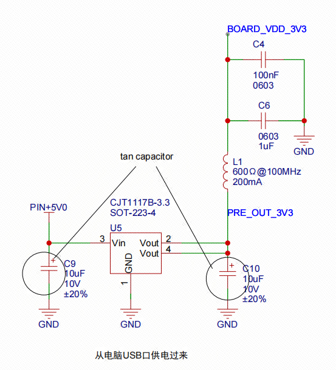

上面这个是扩展板板载的LDO，将从天空星USB过来的5V降压成3V3,具体给哪些芯片使用，可以看本文开头的硬件框图所标注的。除了蜂鸣器，这个LDO给扩展板上所有的芯片供电。在3V3输出端还串联了一个磁珠，并联了两个电容，`BOARD_VDD_3V3`是给板子上的电流采集芯片TP181供电使用的，可以减少干扰。

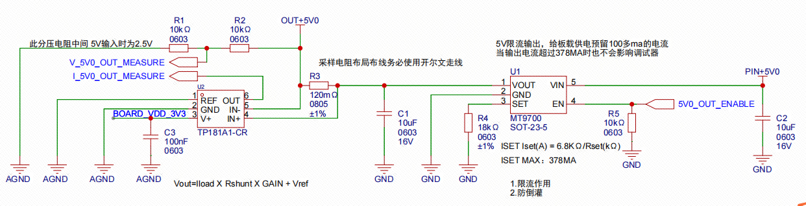

上图是多功能调试器的5V输出，从天空星的USB口的5V过来，这里可以分成两部分来看，以R3采样电阻为分界线，左边是电流采集和电压采集功能，右边起到控制该路输出的功能，主要起到限流和防倒灌作用。这里的5V输出可以给天空星和梁山派开发板调试使用，当然你就把它单纯的当个电源输出口也可以，放心接，短路和反接都不会造成本调试器损坏。

右边的MT9700的主要功能是控制5V输出的开关，并提供限流和防倒灌：

1. 限流功能：通过3号引脚的R4来实现，他是一个电子功率开关，根据其手册中所写，Iset(A)=6.8KΩ/Rset(KΩ)，这里R4=18KΩ，也就是设置的限流值为378mA。设置为这个值是因为一般的电脑USB口的最大输出电流就是500mA左右，这里预留100多mA给多功能调试器自身使用，剩下的387mA全部给外部供电使用。这种处理方式，当外部设备异常短路时不会造成本调试器的掉电或损坏。而且该芯片内置过热保护，通过实际测试，运行时直接将5V输出和GND短接，依旧能正常稳定运行，故障消失后，可以自行恢复到原来的性能。
2. 防倒灌：本电子负载开关芯片自带逆流阻断，当外部设备异常，电流从输出口倒灌回USB口时会及时阻断，不会影响调试器的正常运行，防止损坏昂贵的电脑设备。
3. 开关功能：因为本调试器在天空星调试口同时引出了5V供电和3V3供电，正常情况下这两个电源是不能同时供电的，所以在连接天空星进行调试时，一路开启时另一路就需要关闭，这里直接通过一个GPIO引脚连接到第4个引脚就可以实现了，R5这个下拉电阻只是为了保证在系统启动瞬间，IO处于随机状态，外部下拉让MT9700默认不输出防止意外出现。

左边是5V输出的电压采集和电流采集，TP181是一款国产的电流检测放大器，电压采集就是通过常用的电阻分压来实现的：

1. 电流采集：其实TP181就是一个运放，只不过里面集成了高精度电阻，放大倍数是固定的，这里我选用的是TP181-A1，它的增益是固定的50倍。R3是一个120mΩ的采样电阻，看对应的数据手册可以知道他的公式是Vout=Iload X Rshunt X GAIN + Vref，也就是说当这个回路流过500mA的电流时，芯片第6脚OUT的输出就等于0.5x0.12x50=3V，青春版天空星芯片的参考电压默认是3.3V，也就是说芯片的ADC引脚最大能测量到的电压就是3.3V，所以这个电流采集电路在留点余量的情况下最大就可以通过500mA的电流。结合上面MT9700限流378mA，这里足够用了。
2. 电压采集：如上段所说，天空星的参考电压是3.3V，也就是芯片最大只能接受3.3V的电压，而这里我们输出的是5V，就需要进行分压处理，通过在R1和R2中间进行采样就可以实现，当该路输出5V时，中间点的电压为2.5V。`实际电压=V_5V0_OUT_MEASURE x 2`。这个只需要在程序里面进行转换就可以了。

3.3V的输出和上面类似，就不再进行赘述了，这里只强调一下不同点：

1. 限流的电流变成了523mA，这主要是为了让这两路输出的功率尽量差不多，5V部分的最大输出功率=0.378x5=1.89W，同样的3V3部分的最大输出电流=P/U=1.89/3.3≈0.573A。
2. 电流采集不变，还是最大500mA，电压采集部分的分压电阻变了，当输出端输出3.3V时，单片机引脚采集到的电压是2.75V，可能有人会说参考电压是3.3V，直接不用电阻进行分压也可以啊，理论上是这样，但实际上不可行，因为做什么都要留余量，假如有电压波动，3.3V的上限有可能会让单片机引脚承受超过3.3V的电压从而造成损坏。`实际电压=V_3V3_OUT_MEASURE x （(10K+2K)/10K）=V_3V3_OUT_MEASURE x 1.2`。

还有一个小细节，这里的TP181是将电流值转化为电压值，属于模拟器件，所以它的地都是`AGND`，这个扩展板上的`AGND`和天空星排针上的`AGND`是连在一起的，具体天空星上的`GND`和`AGND`是如何处理的还请移步去天空星的工程查看。

## PD诱骗输出

在扩展板上还有一个TYPE-C口，它不给板上的元件供电。它存在的作用就是为了从我们常见的手机充电器上诱骗出需要的电压给我们使用。如果大家需要用到大电流或者5V以上的电压就需要把这个口连入支持PD协议的充电头，板载的CH224K芯片可以通过特定的通讯协议从PD充电头里面诱骗出对应电压。

在这里我准备了两个输出接口，一个是5.08mm的插拔式接线端子，可以方便用户输出最高100W（20V-5A）的电流，可以使用一字螺丝刀固定并接入普通供电线。另外一个是2P的GH1.25的座子，和泰山派开发板上用的一样，直接使用同向线对插两个座子就可以给泰山派供电了。

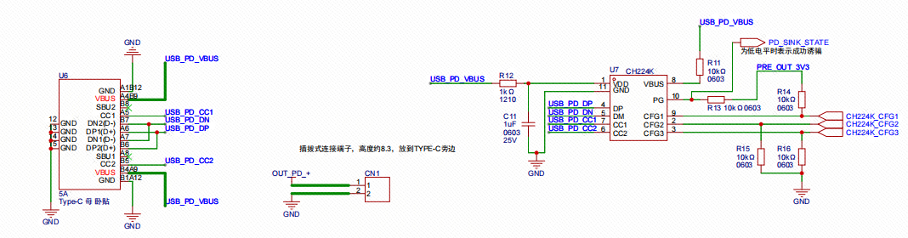

如上图所示，左边是我们需要接入PD充电头的TYPE-C口，中间是5.08mm的插拔式接线端子，方便我们连接外部设备，右边的就是控制PD充电头输出特定电压的CH224K芯片了。他的具体作用我们可以去立创商城上查看他的数据手册，其手册的5.2章介绍了电压档位的配置，第一种是通过修改不同的电阻阻值实现不同请求电压的应用场合，一般都是请求固定档位的电压。第二种是通过MCU控制GPIO电平来动态调整请求的电压。下图是请求电压对应的引脚电平真值表：

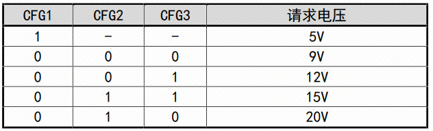

可以看到只要CFG1的电平是高电平，无论CFG2和CFG3如何变，CH224K的请求电压始终都是5V。为了保护用电设备，上面的原理图中在这三个引脚都配置了上下拉电阻，来确保在单片机启动瞬间，当引脚处于随机状态时强制让芯片的请求电压固定为5V。

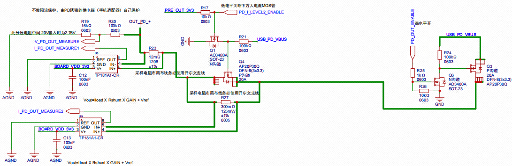

我们从右往左看，右边这个Q3和Q6起到控制PD诱骗的电压是否输出的功能，在这里我们需要实现的是电压高测端的导通和断开。那为什么一个简单的开关功能为什么需要两个MOS管呢？首先在这里，实际起通断作用的是P沟道MOS管-Q3，起驱动作用的是N沟道MOS管-Q6。

在本系统中，我们天空星单片机IO口最高只能输出3.3V，PD诱骗最高电压可以达到20V，P沟道MOSFET是通过将门极电压相对于源极电压降低来开启的。在高侧开关应用中，P沟道MOSFET的源极接高电压（20V），若要关闭MOSFET，门极需要接近源极电压（即20V）。而要打开MOSFET，门极电压需要低于源极电压一定值（例如15V或更低），这对单片机来说是不直接可行的，因为单片机的输出电压通常只有3.3V或5V，单纯用单片机IO口是不能直接控制这个20V输入的PMOS的。

所以我们需要引入一个能控制20V的驱动级，通常在P沟道MOSFET的门极和单片机输出之间加入一个N沟道MOSFET来实现。这样，单片机引脚输出的3.3V就可以直接控制N沟道MOSFET的开关。当N沟道MOSFET关闭时，其输出（连接到P沟道MOSFET的门极）通过上拉电阻被拉高到源电压（20V），导致P沟道MOSFET关闭；当N沟道MOSFET打开时，它会将P沟道的门极拉低到接近地电压，从而打开P沟道MOSFET。

这两个MOS管相互配合，就可以让低电压单片机的输出来控制高电压的导通和关断。N沟道MOS管旁边的R26是一个下拉电阻，主要是为了让该路输出在系统还未上电前保持关断状态，防止高压意外输出损坏用电设备。

接下来的中间和左边就是这路PD输出的两路电流采集了，使用串联的方式主要是为了做到切换档位时的0延时，也就是说在档位切换时让用电回路始终导通。这里面单路的电流采集和输出口前的电压检测和之前的5V和3V3输出原理是一样的，这里就不再赘述。重点说一下为什么要分两路以及如何实现档位切换的0延时。

首先，想要做到0延时，就需要这两个档位同时采集，而且档位切换时还不能造成用电回路断开。在这里用了两个采样电阻R27和R23，他们都有对应的电流检测芯片，只要同时采集这两个TP181的输出口电压就可以了，在程序中只要配置ADC的序列转换，使能一下DMA就可以做到同时采集了。中间的电流通路是有两个的，一路是直接通过R27这个采样电路流到输出端；另外一路是通过上面的Q4这个P沟道MOS管流出到输出端。因为R17这个上拉电阻的存在，Q4这个MOS管默认是导通状态，根据欧姆定律，并联分流，该MOS管和对应采样电阻所组成的这块导体的阻值会接近于MOS管的导通内阻，又因为MOS管的导通阻值都很小，可近似认为把采样电阻两端短路了，这样绝大部分的电流都是通过MOS管流向了输出端。这种工作方式默认就是大电流档位，当电流过小，需要切换到低电流档位时，只需要将MOS管断开，这样电流就只能通过R27这个采样电阻流向输出端，从而实现了档位切换，需要注意的是，流经这个采样电阻的功率不能超过该采样电阻能承受的最大功率。

那么为什么只做了两个档位呢？一是受限于成本，二是受限于选用的芯片性能。当前选用的国产电流检测芯片TP181和INA199是可以PINtoPIN替换的，而TP181没有对应的计算工具，所以下面的图表来自INA199。

> - 第一档   5A量程，采样电阻12mΩ  预计最小电流为200ma   最大功率0.3W，可以看到下表，电流越小，误差越大，绿色的线是对标TP181的，当电流在200mA时，电流误差已经达到了10%。所以此时必须要切换档位了。
>
> 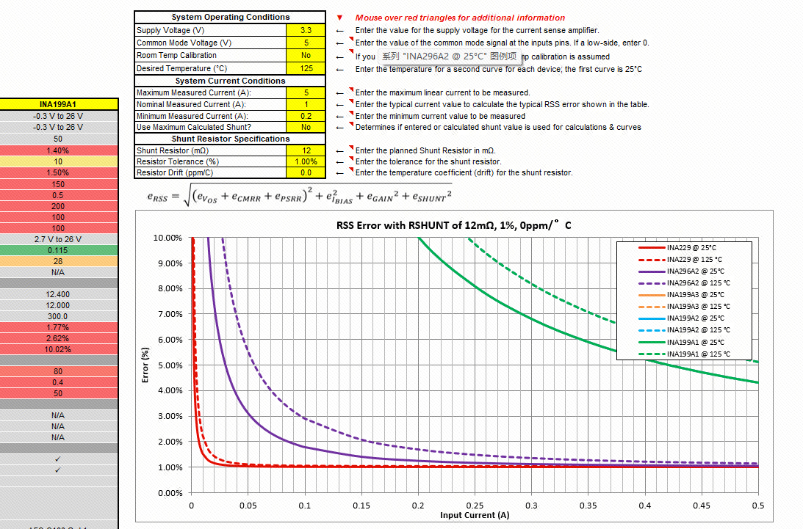
>
> - 第二档  200mA量程，采样电阻300m欧， 预计最小电流10ma，    最大功率0.012W
>
> 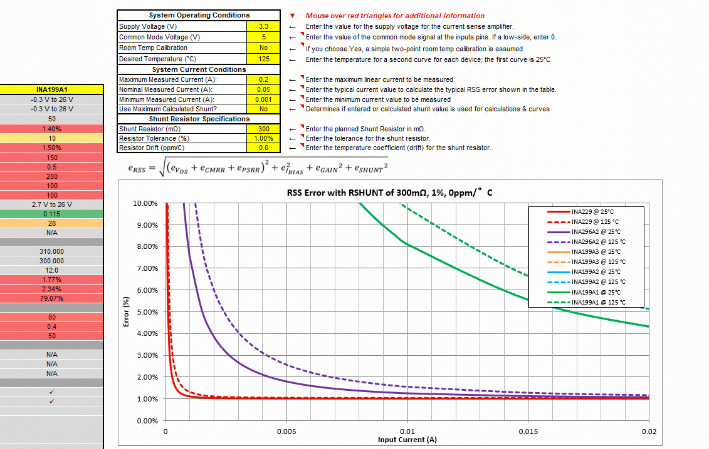
>
> 所以这个PD输出档位只适合10mA以上的检测，如果需要精确的小电流检测还需要使用外部的测量设备。如果想要达到更高的采样精度，就需要更换精度更高的采样芯片或者直接使用精密运放自行搭建了，受限于成本，该多功能调试工具在这里只讲清原理，软硬件都是开源的，欢迎大家自行修改DIY。

## 蜂鸣器-按钮-屏幕-LED

这页原理图实现了蜂鸣器驱动，五个按钮，一个FPC的屏幕驱动和座子，四路LED灯。因为本多功能调试工具是软硬件全开源的，第一个目的是为大家提供一个开源的开发工具，可以用来调试当前的立创开发板。第二个目的就是顺带做一块天空星的扩展板，阻容器件都是0603以上的，方便大家自行焊接，引入的无源蜂鸣器可以让大家学习PWM；按钮可以让大家学习GPIO输入；屏幕可以让大家学习SPI控制，移植图形界面并实现；4路LED也是为了致敬梁山派开发板，大家可以学习GPIO输出，自己做个流水灯。

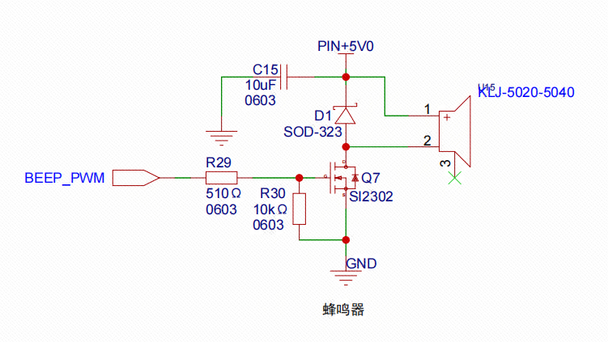

蜂鸣器可以将电信号转化为声音信号，可以向用户提供声音反馈或者警报信号。 蜂鸣器从构造类型上有电磁式和电压式两种，从驱动方式上来说有无源（由外部方波驱动）和有源（由内部驱动，外部给电就行）两种。按封装方式的不同也可以分插针式和贴片式。那么就开始打开立创商城开始选型吧，还是选国产的，一般来说电磁式蜂鸣器的动作电压可以比较低。 我选择的是无源电磁式贴片蜂鸣器，工作电压4-6v，频率4000Hz，这里的频率是指他在这个频率下的声音最响。

> D1在这里的主要作用是保护这个驱动的MOS管，因为蜂鸣器和电机一样是一个感性元件，也就是说它的电流是不能瞬变的。必须有一个续流二极管提供续流。如果没有这个续流二极管，停止给蜂鸣器供电的时候在蜂鸣器两端会有反向感应电动势，产生高达几十V的尖峰电压，很有可能损坏驱动电路。
>
> R29:限流电阻，防止电流太大损坏芯片的PWM输出引脚。
>
> R30:就是一个简单的下拉电阻了，这里主要还是冗余设计，防止单片机在上电瞬间GPIO口输出不确定电平造成蜂鸣器的异常响动，当前我们这里用的无源蜂鸣器是需要特定频率的PWM波才会鸣叫的，只有有源蜂鸣器才会出现这个情况。在实际生产时，这个电阻可以进行不贴处理。大家在平时做电路设计时可以学习这一点，当老板需要更换有源蜂鸣器时你就不会太被动了。

屏幕部分我这里选用的是中景园电子的插接式1.54寸240x240的lcd屏幕，这个也没啥好说的，参考厂家的原理图，核对好FPC座子的引脚号和顺序，确认FPC接触点是上接还是下接就可以了。

剩下的按钮，LED在这里也不赘述了，都是很简单的GPIO输入输出功能，也是都和GPIO直连的，大家一看就懂了。

## RS485-RS232

本多功能调试器自带一个TTL串口，在实际工作中，TTL电平的串口,RS232和RS485都很常用（它们都是串口，只是物理电平定义不一样），所以也添加了MAX3485和MAX3232。当软件功能实现USB的DAPLINK和CDC串口功能后，剩下的USB端口已经不足以再实现一条CDC串口了。所以虽然天空星还有很多路硬件串口可供232和485使用，它们也没办法在连入PC后独立使用了。于是为了简化程序难度，提高可靠性，这里使用两个与门组合实现了三路与门输入。用一路硬件串口同时连接TTL串口，RS485和RS232。详情请看下面的原理图。

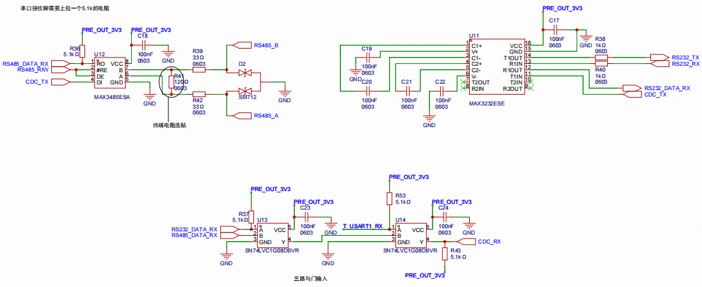

这种实现方式，当在电脑上用串口助手向多功能调试器发送信息时，TTL串口，RS485和RS232会同时发出相同的内容。而接收部分的处理就要重点分析中间下面这个三路与门输入了。大家都知道，串口在空闲状态下是高电平，当这3路任意一路收到信号就会有低电平，因为与门的特性，最终传递到单片机的串口引脚就会变成低电平。也就是说，这只能让其中一路工作。当RS232工作时，其他两路是不能接其他设备的，否则会造成乱码。

## 输出接口部分

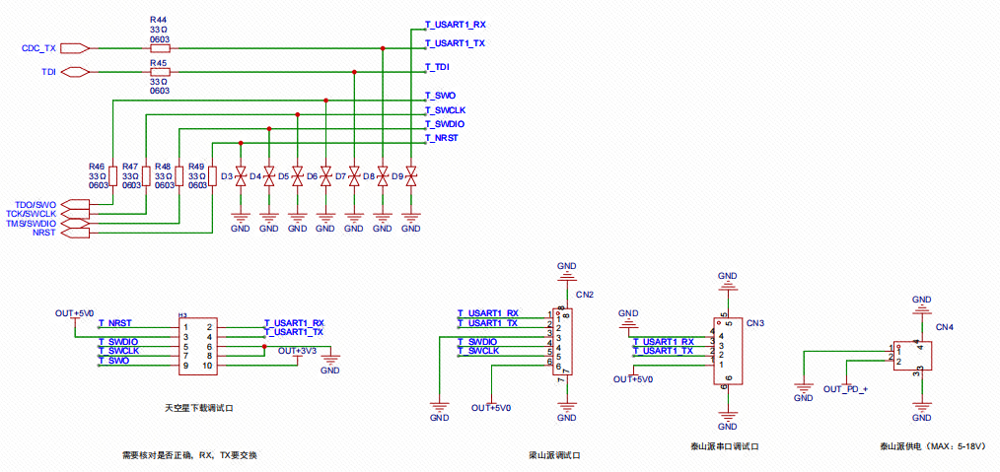

左上角是各输出口的串接电阻和TVS防护，下面依次是天空星开发板的调试接口，梁山派开发板的调试接口以及泰山派串口调试口和供电口。是专门针对立创开发板各开发板制作的。大家如果手里有对应的开发板，就可以直接用专门的排线连接，免去核对引脚的麻烦。当然，如果有其他第三方开发板不兼容这些也可以直接接杜邦线，天空星的调试口就是常用的排针，可以直接引出SWD接口和串口。

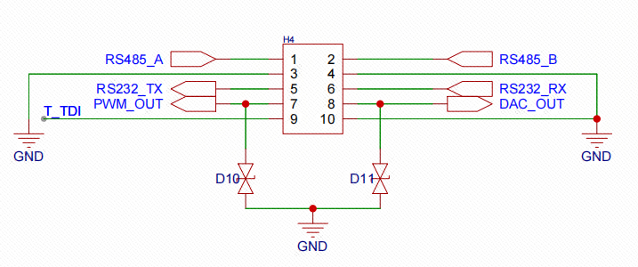

这个接口和天空星的下载调试口一样，都是2x5的双排2.54间距的排针，这里加入了T_TDI，配合天空星的调试口可以让让本调试器可以用JTAG方式调试目标设备。1，2号引脚是RS485的输出口，需要注意的是RS485属于半双工设备，在发送过程中是不能接受数据的，具体什么时候该发什么时候该收就看软件如何处理了。5,6号引脚是RS232的输出口，这个是全双工的。7号引脚是PWM输出口，在屏幕上可以设定周期和脉宽就可以输出不同的PWM波了。8号引脚是DAC输出口，通过软件实现DMA+硬件定时器+DAC就可以实现正弦波，方波，三角波，梯形波，上升斜坡锯齿波，下降斜坡锯齿波输出了，当然，也可以通过在屏幕上输入32个数据来输出任意波形，不过1.54寸的屏幕有点小，输入这32个DAC数据时可能会费点时间，这就具体看大家如何调试使用了。

# PCB布局布线

首先，和天空星左右两边排针相对应，扩展板的左右两边排母也需要位置相同。

## 接口部分

制作这个天空星的主要目的是让大家在调试立创开发板时有更方便的工具。为了同时适配天空星，梁山派和泰山派，首先硬件上需要有对应连接口，其次软件适配上需要支持，比如泰山派默认1.5M的波特率就对本工具虚拟CDC串口提出了极高的要求。

板子的左右两边是排针排母，能和外部连接的就只有板子的上下两面，所以优先要考虑的的接口就是天空星的2x5P排针，梁山派的sh1.0-6P座子，泰山派的GH1.25-4P串口调试口和GH1.25-2P供电口。同时还规划了RS232，RS485，JTAG引脚，PWM和DAC输出，为了统一风格以及对称美观，这里选用和天空星调试口一样的2x5P排针，如下图右下角的2x5p排针所示：

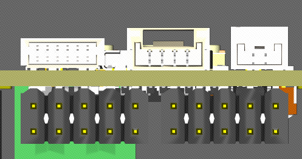

板上从左往右分别是梁山派调试口，泰山派调试口及泰山派供电口，板下左边的2x5P排针是天空星调试口，右边的2x5P排针是杂类，容纳了其他输出接口，详情定义请看电路原理图。

泰山派如果要驱动外部液晶大屏，只有5V供电是不够的，所以泰山派的供电接口需要支持15V输出。如上图右上角的GH1.25-2P就是给泰山派供电的座子，连线时需要使用同向线。在原理图里面我们也知道了我们这个扩展板上也有一个TYPE-C接口，用来从充电头通过PD协议诱骗需要的电压。所以如下图所示：

板下左边的TYPE-C是PD诱骗口，要注意和天空星上的TYPE-C的商城C编号是不一样的，这个可以支持5A的大电流。为了方便大家接线引出，加入了右边绿色的这个插拔式公头端子，后续使用时直接买一个端子母头插进去就可以使用了，这个对应的母头端子是自带锁紧机构的，使用时直接用一字螺丝刀拧松，接入供电线后拧紧就可以正常使用了。

## 采样电阻

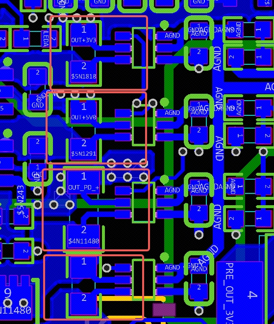

采样电阻相关的连线方式全部使用开尔文连接方式，这样的走线方式可以最大限度的大电流变化时带来的噪声，可以避免采样电流在PCB走线上的压降而产生的误差，这种方式可以提高测量精度。

## 大电流走线

PD诱骗出的电源路径最高100W，20V@5A，所以从TYPE-C到拔插式端子之间的铜皮一定要厚。

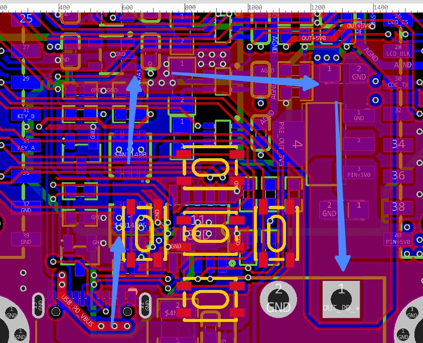

从TYPE-C出来，经过内层2的一大片铜皮厚进入底层的两个MOS管，再通过十几个过孔到达顶层大铜皮后直连到输出端子。实测这个走线在20V5A连续通电十分钟的情况下表面只是微热。泰山派的供电也是从PD口而来，只不过它需要的电流就小多了，直接在内电层分割后通入上层GH1.25引脚就可以了，如下图：

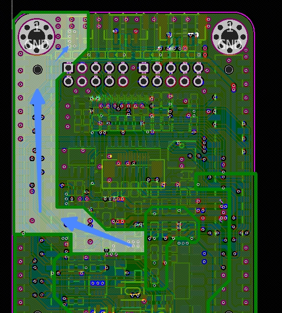

## 杂项

剩下要注意的也不多，都是一些小细节。比如说RS485记得走差分；LDO的两个输入输出钽电容要尽量靠近芯片；所有外部接口的TVS防护都需要先通过TVS再接到芯片引脚；4个LED灯尽量居中等距放置等。